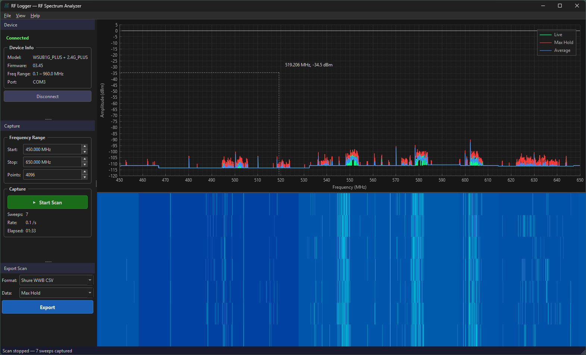

# RF Logger

Cross-platform (Mac, Windows & Linux) RF spectrum analyzer for the pro audio industry. Capture, visualize, and export RF spectrum data for use with **Shure Wireless Workbench** frequency coordination.



## Features

### Spectrum Analysis
- **Real-time spectrum display** with live, max hold, and average traces (individually togglable)
- **Interactive pan & zoom** — drag and scroll to explore frequency and amplitude ranges
- **Crosshair overlay** with live frequency/amplitude readout on mouse hover
- **Sweep statistics** — live sweep count, sweep rate (sweeps/sec), and elapsed time
- **Quick-start optimization** — high-point scans show an immediate low-resolution preview, then reconfigure to full resolution
- **Auto-fit amplitude** — automatically scales the amplitude axis after the first full-resolution sweep

### Waterfall / Spectrogram
- Time-scrolling spectrogram with configurable depth (default 200 rows)
- Color gradient mapping from dark blue (noise floor) through cyan, green, yellow, to red (strongest signals)
- Adjustable amplitude range and time depth

### Frequency Markers
- Add markers by clicking the spectrum or via the marker panel dialog
- Custom labels, colors, and per-marker visibility toggle
- Default color cycle: yellow, orange, magenta, cyan, light red

### Peak Detection / Detected Frequencies
- **Automatic signal detection** — finds local maxima above a noise-floor-relative threshold
- **Configurable threshold** — adjustable dB offset above the estimated noise floor (default 10 dB)
- **–3 dB bandwidth estimation** per detected peak
- **Peak merging** — collapses nearby peaks within a minimum separation (default 25 kHz)
- **Sortable frequency list** with frequency, amplitude, and bandwidth columns
- **Auto-refresh** or manual detect-now modes
- Click a detected frequency to highlight it on the spectrum

### Export
- **Shure WWB CSV** — direct import into Wireless Workbench
- **Generic CSV** — includes metadata headers (date, device, session, frequency range)
- **Export dialog** with data source selection (max hold, average, or last sweep) and live preview of the first 10 lines
- **Quick-export panel** — dockable panel with format and data source dropdowns for one-click export

### Device Management
- **Auto-detection** of device type on connection
- **USB hotplug** — serial port polling every 2 seconds with automatic connect on new device appearance
- **Graceful disconnect** on USB unplug with status feedback
- Status indicator (waiting → connecting → connected → scanning)

### User Interface
- **Dark theme** optimized for stage and production environments
- **Dockable panels** — device info, capture controls, export, markers, and detected frequencies panels are movable, floatable, and closable
- **Full-screen mode** — hides all docks, auto-hides cursor after 3 seconds of inactivity
- **Settings persistence** — window geometry and capture parameters saved between sessions
- **Update checker** — checks for new releases via the GitHub Releases API
- **Crash handler** — global exception handling (C++ exceptions, POSIX signals, Windows SEH) with crash log written to disk

## Supported Devices

| Device | Connection | Frequency Range | Sweep Points | Status |
|--------|-----------|----------------|-------------|--------|
| RF Explorer (Basic) | USB Serial (500 000 baud) | Model-dependent (433 MHz–6 GHz) | 112–4096 | ✅ Supported |
| RF Explorer (PLUS) | USB Serial (500 000 baud) | Model-dependent (433 MHz–6 GHz) | 112–4096 | ✅ Supported |
| TinySA Basic | USB Serial (115 200 baud) | Low 100 kHz–350 MHz / High 240–960 MHz | 51–65 535 | ✅ Supported |
| TinySA Ultra | USB Serial (115 200 baud) | 100 kHz–6 GHz | 25–65 535 | ✅ Supported |
| RTL-SDR | USB (librtlsdr) | Device-dependent | Device-dependent | 🔧 Optional |

## Keyboard Shortcuts

| Shortcut | Action |
|----------|--------|
| `Ctrl+E` | Export scan data |
| `Ctrl+L` | Clear traces |
| `Ctrl+0` | Reset zoom |
| `F11` | Toggle full screen |
| `ESC` | Exit full screen |
| `Ctrl+Q` | Exit |

## Building

### Prerequisites

- **CMake** 3.21+
- **Qt 6.6+** with modules: Widgets, Core, Gui, Network, SerialPort, PrintSupport
- **C++20** compiler (MSVC 2022, GCC 12+, Clang 14+, Apple Clang 15+)
- **librtlsdr** (optional, for RTL-SDR device support)

### External Dependencies

These are fetched automatically during CMake configuration:

| Library | Version | Purpose |
|---------|---------|---------|
| [QCustomPlot](https://www.qcustomplot.com/) | 2.1.1 | Spectrum and waterfall chart rendering |
| [KissFFT](https://github.com/mborgerding/kissfft) | 131.1.0 | FFT signal processing |

### Build Steps

```bash
# Clone
git clone https://github.com/jpwalters/RFLogger.git
cd RFLogger

# Configure (QCustomPlot and KissFFT are fetched automatically)
cmake -S . -B build -DCMAKE_BUILD_TYPE=Release

# Build
cmake --build build --config Release --parallel

# Run tests
cd build && ctest --output-on-failure -C Release
```

### Build Options

| Option | Default | Description |
|--------|---------|-------------|
| `RFLOGGER_BUILD_TESTS` | ON | Build unit tests |
| `RFLOGGER_ENABLE_RTLSDR` | ON | Enable RTL-SDR support (requires librtlsdr) |
| `RFLOGGER_VERSION` | from project() | Override version from CI tag |
| `RFLOGGER_DEBUG_MENU` | OFF | Show Debug menu with crash-test actions (dev only) |

## Usage

1. **Connect** your RF Explorer or TinySA via USB
2. **Select** the serial port and device type (or use Auto Detect)
3. **Set** the frequency range and sweep points
4. **Start scanning** to see live spectrum data
5. **Export** to Shure WWB CSV or Generic CSV for frequency coordination

### Export Formats

#### Shure WWB CSV

Two columns, no header — ready for Wireless Workbench import:
```
470.000000,-85.5
470.500000,-72.3
471.000000,-100.0
```

Column 1: frequency in MHz (6 decimal places) · Column 2: amplitude in dBm (1 decimal place)

#### Generic CSV

Includes metadata headers followed by a standard two-column table:
```
# RFLogger Export
# Date: 2026-04-05T12:00:00Z
# Device: RF Explorer WSUB1G
# Start Freq (MHz): 470.000000
# Stop Freq (MHz): 698.000000
# Points: 112
Frequency (MHz),Amplitude (dBm)
470.000000,-85.5
470.500000,-72.3
...
```

## Testing

The test suite uses Qt Test and covers core data and export logic:

| Test | Covers |
|------|--------|
| `tst_SweepData` | Frequency/amplitude calculations, min/max |
| `tst_ScanSession` | Max hold, average, sweep accumulation, clear |
| `tst_WwbExporter` | WWB CSV output format and precision |
| `tst_GenericCsvExporter` | Metadata headers, device/session info |

```bash
cd build && ctest --output-on-failure -C Release
```

## Project Structure

```
src/
├── main.cpp                  Entry point
├── app/                      MainWindow, AboutDialog, SettingsManager,
│                             UpdateChecker, CrashHandler
├── config/                   Version.h.in template
├── data/                     SweepData, ScanSession, FrequencyMarker,
│                             DetectedSignal, PeakDetector
├── devices/                  ISpectrumDevice, RFExplorerDevice, TinySADevice,
│                             RtlSdrDevice (optional), DeviceManager
├── export/                   WwbExporter, GenericCsvExporter
├── theme/                    DarkTheme
└── ui/                       SpectrumWidget, WaterfallWidget, DevicePanel,
                              CaptureControls, MarkerPanel, ExportPanel,
                              ExportDialog, FrequencyListPanel
tests/                        Qt Test suite
resources/                    Icons, .qrc, .rc, .desktop
cmake/                        FindRtlSdr.cmake
```

## Releases

Pre-built binaries are available on the [Releases](https://github.com/jpwalters/RFLogger/releases) page. Tagged pushes (`v*`) trigger automated builds via GitHub Actions.

| Platform | Package | Notes |
|----------|---------|-------|
| Windows | NSIS installer (`.exe`) | Bundled Qt DLLs, Start Menu shortcut |
| macOS | DMG | Apple Silicon, code-signed and notarized |
| Linux | AppImage | x86_64, bundled Qt libraries |

## License

[MIT](LICENSE) — Copyright 2026 James P. Walters
